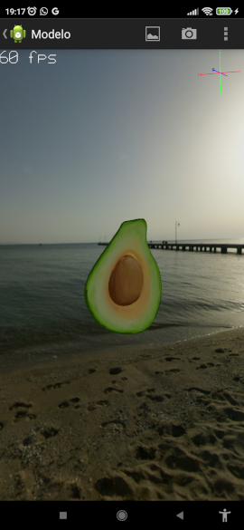

Android 3D Model Viewer
=======================


This is a demo of OpenGL ES 2.0.
It is basically an android application with a 3D engine that can load Wavefront OBJ, STL, DAE & GLTF files.
The purpose of this application is to learn and share how to draw using OpenGL language.

* Wafefront format (OBJ): https://en.wikipedia.org/wiki/Wavefront_.obj_file
* STereoLithography format (STL): https://en.wikipedia.org/wiki/STL_(file_format)
* Collada format (DAE): https://en.wikipedia.org/wiki/COLLADA
* GLTF format (gltf): https://www.khronos.org/gltf/


News (04/10/2022)
=================

* Preparing version 4.0.0 for Google Play release...
* New orthographic, isometric and free camera views
* GLTF basic support :)
* Rebranding to org.the3deer

Demo
====

Checkout this to see the features of the application: https://www.youtube.com/watch?v=PV92DKohXXk


Android Market
==============

[](https://f-droid.org/en/packages/org.andresoviedo.dddmodel2/)
[](https://play.google.com/store/apps/details?id=org.andresoviedo.dddmodel2)


Notice
======

* Collada support is limited. Collada renderer currently supports a maximum of 60 bones.
* In order to see models in 3D virtual reality, you need red-cyan and/or VR glasses
* If you have any issue in general,please open an issue and attach model if possible, specifying Android version and Device model.  


About
=====

Load 3D models and see how to do it with this open source code application.

The main purpose of this app is to show how to draw in android using the OpenGL 2.0 by sharing the source code.
So please, don't expect this application to be much richer or nicer than the ones already published in the app store,
but at least it's opened to anyone who wants to contribute or don't want to start a similar project from scratch.

As this is my first android app and Im still learning the OpenGL 2.0 language, it is highly probable that there are bugs;
but I will try to continue improving the app and adding more features. So please send me your comments, suggestions or
complains by opening an [issue](https://github.com/the3deer/android-3D-model-viewer/issues).

The app comes with some included 3D models that have different licenses.


Whats next
==========

* Improve support for glTF standard format
* VR without glasses (on hold)
* Augmented reality


Features
========

  - [x] Supports >= Android 4.1 (Ice Cream Sandwich) - Min API Level 16 -> Target API Level 31
  - [x] OpenGL ES 2.0 API
  - [x] Multiple Formats: 
    - [x] OBJ (wavefront)
    - [x] STL (STereoLithography)
    - [x] DAE (Collada-BETA)
    - [x] GLTF (GL Transmission Format)
  - [x] Vertex Normals support
  - [x] Transformation support: scaling, rotation, translation, orientation
  - [x] Colors support
  - [x] Textures support
  - [x] Lighting support
  - [x] Multiple Rendering Modes 
    - [x] triangles
    - [x] wireframe
    - [x] point cloud
    - [x] skeleton
  - [x] camera support
    - [x] perspective
    - [x] orthographic
    - [x] isometric views
    - [x] free
  - [x] skeletal animations (collada dae)
  - [x] ray collision detection
  - [x] stereoscopic 3D: anaglyph + cardboard
  - [x] other:
     - [x] Polygon with holes
     - [x] Smoothing
     - [x] Bounding box
     - [x] Skybox
     - [x] Object picking
     - [x] file explorer
     - [x] repository explorer
     - [x] texture loader
     - [x] lightweight: only 1.3 Megabyte (embedded models excluded)

  
Try it
======

You can install the application in either of these ways:

  * Play Store:  https://play.google.com/store/apps/details?id=org.andresoviedo.dddmodel2
  * APK: [app-release.apk](app/build/outputs/apk/release/app-release.apk)
  * Source code: clone the repository, compile with gradle and install with adb

```
    export ANDROID_HOME=/home/$USER/Android/Sdk
    ./gradlew assembleDebug
    adb install -r app/build/outputs/apk/app-debug.apk
    adb shell am start -n org.andresoviedo.dddmodel2/org.the3deer.app.model3D.MainActivity
```

Open the application. You should see a menu. From there you can load models
Once the model is rendered, pinch and rotate to see the 3D scene from another perspective.


Screenshots
===========





Emulator
========

You can run application in an emulator

    // install some file provider (i.e. es file explorer)
    adb devices -l
    adb -s emulator-5554 install .\com.estrongs.android.pop_4.0.3.4-250_minAPI8(armeabi,x86)(nodpi).apk
    // push some files to test file loading
    adb -s emulator-5554 push .\app\src\main\assets\models /sdcard/download


Glasses
=======

You may need one of this glasses to view models in 3D virtual reality.

[](https://amzn.to/2E8LhxC)
[](https://amzn.to/2E8M1Tq)


Dependencies
============

* git submodule add https://github.com/the3deer/android-3D-engine.git engine (3d engine)
* implementation 'com.fasterxml.jackson.core:jackson-databind:2.13.4'  (gltf json parser)


Documentation
=============

Working on it...


Acknowledgement
===============

* For teaching how animation engine works: https://github.com/TheThinMatrix/OpenGL-Animation
* To the lot of user's feedback: https://github.com/the3deer/android-3D-model-viewer/issues
* For the GLTF parser https://github.com/javagl/JglTF
* To the many infinite educational resources found in Internet for free :)


Licenses
========

The following copyright notice and this permission notice shall be included in all
copies or substantial portions of the Software.


    MIT License - Copyright (c) 2022 The 3Deer - https://github.com/the3deer
    GNU LGPL v2.1 Copyright (c) 2001, 2002 Dipl. Ing. P. Szawlowski - STL Parser
    MIT License - https://github.com/javagl/JglTF - GLTF Parser    
    ISC License - Earcut - https://github.com/the3deer/earcut


Assets

 * cowboy       : Unlicense License - https://github.com/TheThinMatrix/OpenGL-Animation
 * stormtrooper : MIT License - https://github.com/hujiulong/vue-3d-model
 * toyplane     : Editorial Uses Only - https://blog.turbosquid.com/turbosquid-3d-model-license/#Editorial-Usage
 * skybox sea   : https://learnopengl.com/Advanced-OpenGL/Cubemaps
 * skybox sand  : Copyright 2012 Mobialia - https://github.com/mobialia/jmini3d
 * repository (parts)  : Community contribution (Professsor S)
 