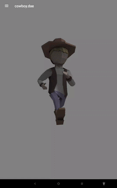
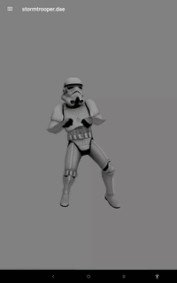
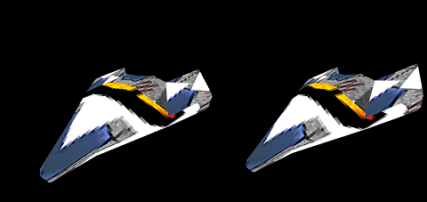

Android 3D Model Viewer
=======================


This is a demo of OpenGL ES 2.0.
It is basically an android application with a 3D engine that can load Wavefront OBJ, STL & DAE files.
The purpose of this application is to learn and share how to draw using OpenGL language.
The application does not use any third party library.

* Wafefront format (OBJ): https://en.wikipedia.org/wiki/Wavefront_.obj_file
* STereoLithography format (STL): https://en.wikipedia.org/wiki/STL_(file_format)
* Collada format (DAE): https://en.wikipedia.org/wiki/COLLADA


News (15/07/2020)
=================

* New version released 3.0.0
* Collada support for polygon with holes
* Wavefront support for smoothing groups
* New FPS counter (frames per second)
* Full refactoring of the code


Demo
====

Checkout this to see the features of the application: https://www.youtube.com/watch?v=PV92DKohXXk


Android Market
==============

[](https://play.google.com/store/apps/details?id=org.andresoviedo.dddmodel2)


Notice
======

* Collada support is limited. Collada renderer currently supports a maximum of 60 bones.
* In order to see models in 3D virtual reality, you need red-cyan and/or VR glasses
* If you have any issue in general,please open an issue and attach model if possible, specifying Android version and Device model.  


About
=====

Load 3D models and see how to do it with this open source code application.

The main purpose of this app is to show how to draw in android using the OpenGL 2.0 by sharing the source code.
So please, don't expect this application to be much richer or nicer than the ones already published in the app store,
but at least it's opened to anyone who wants to contribute or don't want to start a similar project from scratch.

As this is my first android app and Im still learning the OpenGL 2.0 language, it is highly probable that there are bugs;
but I will try to continue improving the app and adding more features. So please send me your comments, suggestions or
complains by opening an [issue](https://github.com/andresoviedo/android-3D-model-viewer/issues) or email me to andresoviedo@gmail.com.

The app comes with some included 3D models that were taken for free from Internet.


Whats next
==========

* Support for glTF standard format
* 3D without glasses
* Augmented reality


Features
========

  - Supports >= Android 4.0.1 (Ice Cream Sandwich) - Min API Level 14 -> Target API Level 28
  - OpenGL ES 2.0 API
  - Formats: OBJ (wavefront), STL (STereoLithography) & DAE (Collada-BETA)
  - calculation of normals
  - transformations: scaling, rotation, translation
  - colors
  - textures
  - lighting
  - wireframe & points mode
  - holes
  - smoothing
  - bounding box
  - object pick
  - camera support
    - tap to select object
    - drag to move camera
    - rotate with 2 fingers to rotate camera
    - pinch & spread to zoom in/out the camera
  - skeletal animations (collada dae)
  - ray collision detection
  - stereoscopic 3D: anaglyph + cardboard
  - other:
    - texture loader
    - lightweight: only 1 Megabyte
    - file explorer


Try it
======

You can install the application in either of these ways:

  * Play Store:  https://play.google.com/store/apps/details?id=org.andresoviedo.dddmodel2
  * APK: [app-release.apk](app/build/outputs/apk/release/app-release.apk)
  * Source code: clone the repository, compile with gradle and install with adb

```
    export ANDROID_HOME=/home/$USER/Android/Sdk
    ./gradlew assembleDebug
    adb install -r app/build/outputs/apk/app-debug.apk
    adb shell am start -n org.andresoviedo.dddmodel2/org.andresoviedo.app.model3D.MainActivity
```

Open the application. You should see a menu. From there you can load models
Once the model is rendered, pinch and rotate to see the 3D scene from another perspective.


Screenshots
===========







Emulator
========

You can run application in an emulator

    // install some file provider (i.e. es file explorer)
    adb devices -l
    adb -s emulator-5554 install .\com.estrongs.android.pop_4.0.3.4-250_minAPI8(armeabi,x86)(nodpi).apk
    // push some files to test file loading
    adb -s emulator-5554 push .\app\src\main\assets\models /sdcard/download


Documentation
=============

https://github.com/andresoviedo/android-3D-model-viewer/wiki


Final Notes
===========

You are free to use this program while you keep this file and the authoring comments in the code.
Any comments and suggestions are welcome.


Contact
=======

http://www.andresoviedo.org


Donations
=========

[](https://www.paypal.me/andresoviedo)


Marketing
=========

If you want to buy 3D glasses on Amazon, thank you for clicking on following links as it may help supporting 
this project:

[](https://amzn.to/2E8LhxC)
[](https://amzn.to/2E8M1Tq)


ChangeLog
=========

(f) fixed, (i) improved, (n) new feature

- 3.0.0 (15/07/2020)
  - (n) Support for Object Groups  (wavefront: o,g, dae: <geometry>)
  - (n) Support for Smoothing Groups (wavefront)
  - (n) migrated project to androidx compat libraries
  - (n) GUI - fps counter - experimental framework
  - (n) Collada support for polygon with holes (<ph>)
  - (i) Complete re-engineering and refactoring of the code
  - (i) Wavefront + Collada Loader reimplemented
  - (f) Fixed overall bugs
- 2.7.0 (13/11/2019)
  - (n) new blending force mode to 50% 
  - (f) fixed light rendering issues on shaders #125 (diffuse + specular)
  - (f) fixed bugs when DAE had multiple geometries #125
  - (f) fixed textures not being linked issue
  - (f) fixed performance issues: now rendering below 5% cpu & no ram allocation
- 2.6.0 (20/10/2019)
  - (n) #81 Support for collada files with multiple geometries
  - (f) #94 fixed setVisible(boolean)
  - (f) #92 fixed multiple color rendering for non-triangulated file.obj
  - (i) overall engine improved
- 2.5.1 (20/05/2019)
  - (f) wavefront loader fixed for meshObject point to negative indices
- 2.5.0 (19/05/2019)
  - (n) new blending toggle
  - (n) new color toggle
  - (i) engine refactoring: externalized shaders
  - (i) engine improved: fixed bugs and removed classes
- 2.4.0 (16/05/2019)
  - (n) stereoscopic rendering: anaglyph + cardboard
- 2.3.0 (27/09/2018)
  - (n) Externalized 3d engine into android library module
  - (n) Wiki initial documentation
- 2.2.0 (11/09/2018)
  - (n) Load models from app repository
  - (i) Reduced app size to only 1 Megabyte
- 2.1.0 (07/09/2018)
  - (n) Skeleton Animation
  - (n) File chooser to load files from any where
  - (f) Collada Animator fixed (INV_BIND_MATRIX, bind_shape_matrix)
  - (f) Collada Animator Performance improved
  - (f) Application refactoring (ContentUtils, Loaders, etc)
  - (f) Several bugs fixed
- 2.0.4 (22/12/2017)
  - (n) Implemented face collision detection algorithm: ray-triangle + octree
- 2.0.3 (21/12/2017)
  - (i) Improved collision detection algorithm (ray-aabb) for selecting objects
  - (i) BoundingBox code cleanup
- 2.0.2 (17/12/2017)
  - (f) Collada XML parser is now android's XmlPullParser
  - (f) Animation engine frame times improved
  - (n) Camera now moves smoothly
- 2.0.1 (08/12/2017)
  - (f) Multiple Collada parser fixes
  - (f) Camera now can look inside objects
- 2.0.0 (24/11/2017)
  - (n) Support for collada files with skeletal animations :)
- 1.4.1 (21/11/2017)
  - (f) #29: Crash loading obj with only vertex info
- 1.4.0 (19/11/2017)
  - (f) #28: Load texture available for any model having texture coordinates
- 1.3.1 (23/04/2017)
  - (f) #18: Removed asReadOnlyBuffer() because it is causing IndexOutOfBounds on Android 7
- 1.3.0 (17/04/2017)
  - (n) #17: Added support for STL files
  - (n) #17: Asynchronous building of model so the build rendering is previewed
  - (f) #17: Added Toasts to buttons to show current state
- 1.2.10 (16/04/2017)
  - (f) #16: Immersive mode is now configurable in the ModelActivity Intent: b.putString("immersiveMode", "false");
  - (f) #16: Background color configurable in the ModelActivity Intent: b.putString("backgroundColor", "0 0 0 1");
  - (f) #16: Fixed vertex normals generation (vertices were missing)
  - (f) #16: Scaling is now implemented in the ModelView Matrix with Object3DData.setScale(float[])
  - (f) #16: Wireframe generation is now using the source data
  - (n) #16: Implemented Point Drawing, like wireframe mode but only the points are drawn
  - (f) #16: Removed trailing slash from parameter "assetDir"
  - (f) #16: Access to ByteBuffers made absolute so there are thread safe (future fixes need this)
- 1.2.9 (11/04/2017)
  - (f) #15: Toggle rotating light
  - (f) #15: Wireframe with textures and colors
- 1.2.8 (10/04/2017)
  - (f) Fixed #14: Camera movement improved. Only 1 rotation vector is used + space bounds set
- 1.2.8 (04/04/2017)
  - (f) Fixed #13: parsing of vertices with multiple spaces
  - (i) Improved error handling on loading task
  - (i) Vertices are defaulted to (0,0,0) if parsing fails
- 1.2.7 (03/04/2017)
  - (i) Removed commons-lang3 dependency
- 1.2.6 (02/04/2017)
  - (f) Fixed #12. Drawing the wireframe using GL_LINES and the index buffer (drawElements)
- 1.2.5 (01/04/2017)
  - (f) Fixed #10. Map meshObject to texture only when using the only loaded texture
  - (f) Fixed #11. Generation of missing vertex normals
- 1.2.4 (30/03/2017)
  - (f) Fixed #5. Memory performance optimization
- 1.2.3 (27/03/2017)
  - (f) Fixed #1. Cpu performance optimization
- 1.2.2 (25/03/2017)
  - (f) Fixed #9. IOOBE loading face normals when meshObject had no texture or normals
- 1.2.1 (27/02/2017)
  - (f) Fixed loading external files issue #6
  - (i) Project moved to gradle
- 1.2.0 (06/04/2016)
  - (n) Implemented selection of objects
- 1.1.0 (30/03/2016)
  - (n) Implemented lighting & toggle textures & lights
  - (i) Refactoring of 3DObjectImpl
- 1.0.0 (27/03/2016)
  - (n) First release in Google Play Android Market
