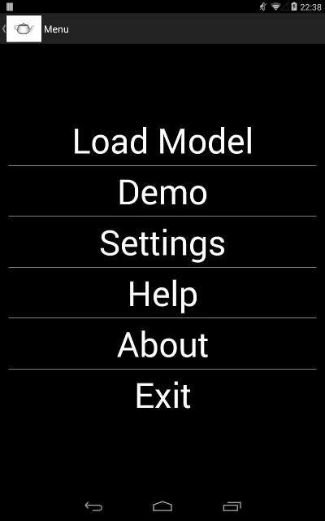
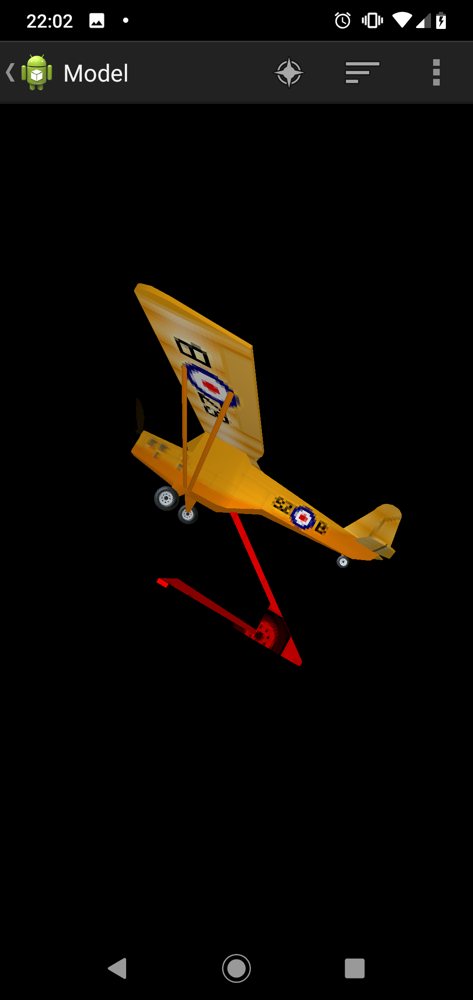
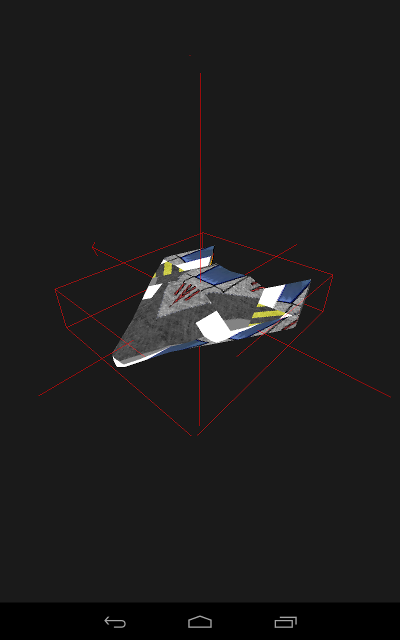
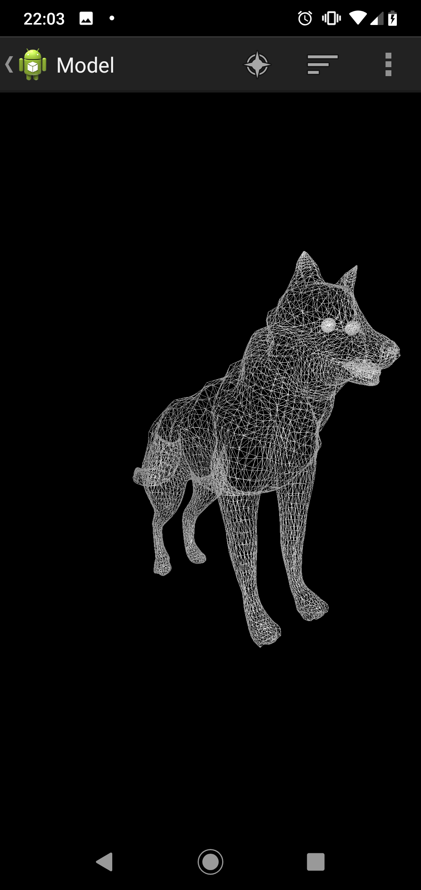
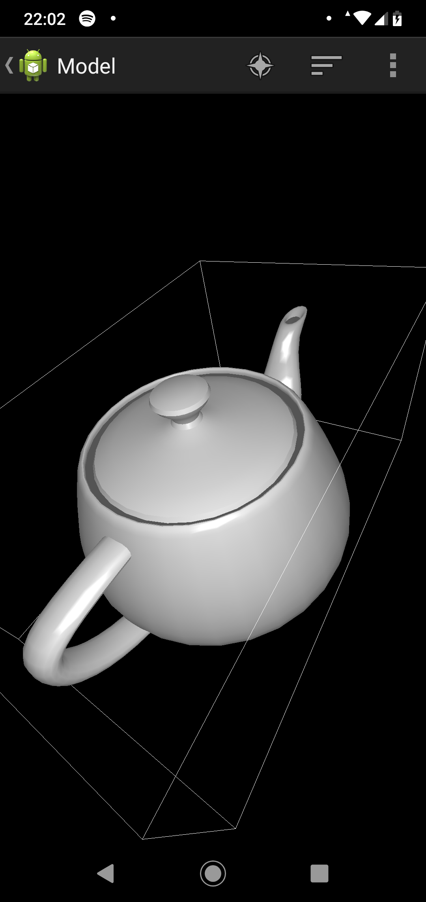
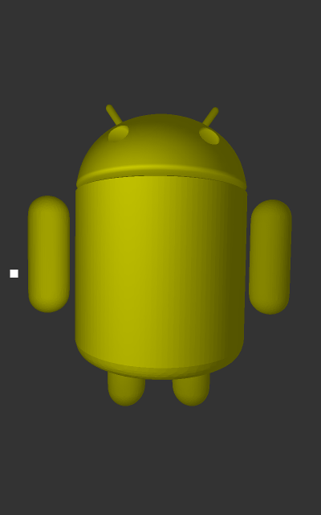
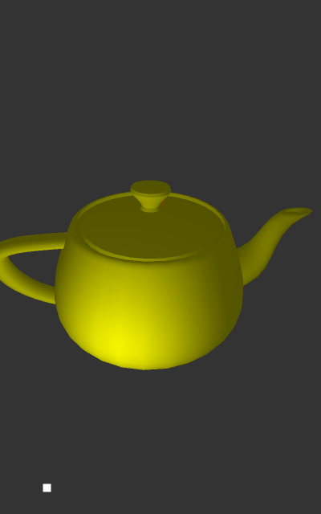

Android 3D Model Viewer
=======================


This is a demo of OpenGL ES 2.0.
It is basically an android application with a 3D renderer that can load Wavefront Obj & STL files.
The purpose of this application is to learn and share how to draw using OpenGL language.


* Wafefront format (OBJ): https://en.wikipedia.org/wiki/Wavefront_.obj_file
* STereoLithography format (STL): https://en.wikipedia.org/wiki/STL_(file_format)


News (23/04/2017)
=================

* Fixed #18: Removed asReadOnlyBuffer() - not working on Android 7
* Enhancement #17: Added support for TLS format
* Fixed #16: Toogle point drawing
* Fixed #15: Toggle rotating light
* Fixed #1: Cpu Performance problems
* Fixed #5: Memory Performance problems


Android Market
==============

https://play.google.com/store/apps/details?id=org.andresoviedo.dddmodel2


About
=====

Load 3D models and see how to do it with this open source code application.

The main purpose of this app is to show how to draw in android using the OpenGL 2.0 by sharing the source code.
So please, don't expect this application to be much richer or nicer than the ones already published in the app store,
but at least it's opened to anyone who wants to contribute or don't want to start a similar project from scratch.

As this is my first android app and Im still learning the OpenGL 2.0 language, it is highly probable that there are bugs;
but I will try to continue improving the app and adding more features. So please send me your comments, suggestions or
complains by opening an [issue](https://github.com/andresoviedo/android-3D-model-viewer/issues) or email me to andresoviedo@gmail.com.

The app comes with some included 3D models that were taken for free from Internet (http://www.turbosquid.com).


Whats next
==========

* Stabilize app performance
* Load multiple textures #3
* Code refactoring
* Carboard support
* Chromecast support
* ...


Features
========

  - OpenGL ES 2.0 API
  - Formats: OBJ (wavefront) & STL (STereoLithography)
  - calculation of normals
  - transformations: scaling, rotation, translation
  - colors
  - textures
  - lighting
  - wireframe & points mode
  - bounding box drawing
  - object selection
  - camera support!
    - tap to select object
    - drag to move camera
    - rotate with 2 fingers to rotate camera
    - pinch & spread to zoom in/out the camera
  - moving of objects (not yet!)
  - primitive collision detection (not yet!)
  - animation of sprites (not yet!)

Try it
======

  * Play Store:  https://play.google.com/store/apps/details?id=org.andresoviedo.dddmodel2
  * APK: [app-release.apk](app/build/outputs/apk/app-release.apk)
  * Source code: clone the repository, compile with gradle and install with adb

```
    export ANDROID_HOME=/home/$USER/Android/Sdk
    ./gradlew assembleDebug
    adb install -r app/build/outputs/apk/app-debug.apk
    adb shell am start -n org.andresoviedo.dddmodel2/org.andresoviedo.app.model3D.MainActivity
```

* Open the application. You should see a menu. From there you can load some demos or load your own model
* Once the scenario is loaded, pinch and rotate to see the 3D scene from another perspective.


Screenshot
==========










Final Notes
===========

You are free to use this program while you keep this file and the authoring comments in the code.
Any comments and suggestions are welcome.


Contact
=======

http://www.andresoviedo.org


ChangeLog
=========

(f) fixed, (i) improved, (n) new feature

- 1.3.1 (23/04/2017)
 - (f) #18: Removed asReadOnlyBuffer() because it is causing IndexOutOfBounds on Android 7

- 1.3.0 (17/04/2017)
  - (n) #17: Added support for STL files
  - (n) #17: Asynchronous building of model so the build rendering is previewed
  - (f) #17: Added Toasts to buttons to show current state

- 1.2.10 (16/04/2017)
  - (f) #16: Immersive mode is now configurable in the ModelActivity Intent: b.putString("immersiveMode", "false");
  - (f) #16: Background color configurable in the ModelActivity Intent: b.putString("backgroundColor", "0 0 0 1");
  - (f) #16: Fixed vertex normals generation (vertices were missing)
  - (f) #16: Scaling is now implemented in the ModelView Matrix with Object3DData.setScale(float[])
  - (f) #16: Wireframe generation is now using the source data
  - (n) #16: Implemented Point Drawing, like wireframe mode but only the points are drawn
  - (f) #16: Removed trailing slash from parameter "assetDir"
  - (f) #16: Access to ByteBuffers made absolute so there are thread safe (future fixes need this)

- 1.2.9 (11/04/2017)
  - (f) #15: Toggle rotating light
  - (f) #15: Wireframe with textures and colors

- 1.2.8 (10/04/2017)
  - (f) Fixed #14: Camera movement improved. Only 1 rotation vector is used + space bounds set

- 1.2.8 (04/04/2017)
  - (f) Fixed #13: parsing of vertices with multiple spaces
  - (i) Improved error handling on loading task
  - (i) Vertices are defaulted to (0,0,0) if parsing fails

- 1.2.7 (03/04/2017)
  - (i) Removed commons-lang3 dependency

- 1.2.6 (02/04/2017)
  - (f) Fixed #12. Drawing the wireframe using GL_LINES and the index buffer (drawElements)

- 1.2.5 (01/04/2017)
  - (f) Fixed #10. Map faces to texture only when using the only loaded texture
  - (f) Fixed #11. Generation of missing vertex normals

- 1.2.4 (30/03/2017)
  - (f) Fixed #5. Memory performance optimization

- 1.2.3 (27/03/2017)
  - (f) Fixed #1. Cpu performance optimization

- 1.2.2 (25/03/2017)
  - (f) Fixed #9. IOOBE loading face normals when faces had no texture or normals
 
- 1.2.1 (27/02/2017)
  - (f) Fixed loading external files issue #6
  - (i) Project moved to gradle

- 1.2.0 (06/04/2016)
  - (n) Implemented selection of objects

- 1.1.0 (30/03/2016)
  - (n) Implemented lighting & toggle textures & lights
  - (i) Refactoring of 3DObjectImpl

- 1.0.0 (27/03/2016)
  - (n) First release in Google Play Android Market
