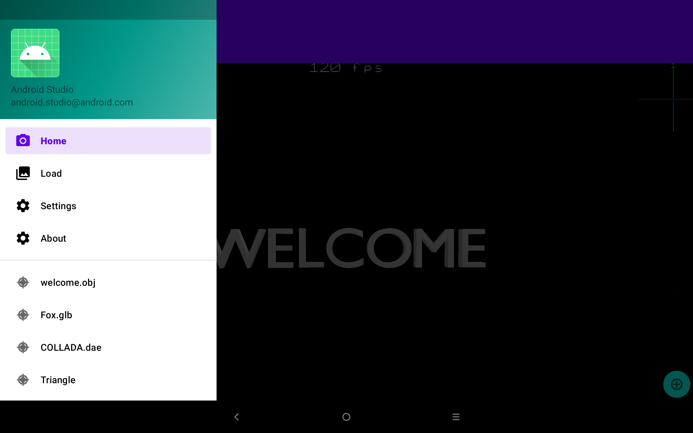
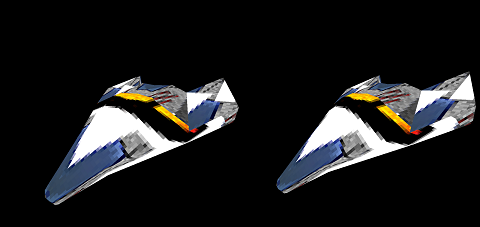

# Android 3D Model Viewer

A powerful, open-source Android application for viewing and inspecting 3D models. Built with a modular architecture and powered by a custom OpenGL ES 2.0/3.0 engine.

## News (18/04/2026)

**Version 5.0.3** *

* **Engine** improvements
    * OpenGL shaders upgraded to **OpenGL 3**. OpenGL 2 shaders is still supported (for older phones)
    * Engine Multiple **Scene**, **Camera** and **Animation**
* **Internationalization (i18n)**
    * Support for **Spanish** language. **English** being the default application language
* **Brand New User Interface (UI)**
    * UI completely rewritten / re-designed from scratch (assisted by AI)
    * UI is now based on **Android Fragments**
    * UI has now 1 **Android Navigation** Drawer (and 1 Android Toolbar)
    * UI has now 3 **Dialogs** to allow the selection of the Scene, Camera & Animation
    * UI has now 1 **Preference** screen to configure some of the Engine properties (skybox, language, etc)
* DAE & GLTF parsers completely rewritten / re-designed from scratch (assisted by AI)
* FBX: **basic** support added. The FBX parser is possible thanks to ufbx (https://github.com/ufbx/ufbx)
    * FBX Features: **static** models only with diffuse textures (no animation / rigging)
* **Game Camera**. Added 1 new Camera Controller that supports 2 joysticks to control a new Camera that can go anywhere

* **This release is possible thanks to the AI (Gemini)**

## Key Features

- **Multi-Format Support**: Load OBJ, STL, DAE (Collada), GLTF, and FBX files.
- **Advanced Rendering**: Support for skeletal animation, normal mapping, and basic lighting.
- **Modern UI**: Built with Android Fragments, Navigation Component, and Material Design.
- **VR Ready**: Integrated Anaglyph and Stereoscopic (VR headset) rendering modes.
- **Interactive Tools**: Wireframe toggles, skeleton visualization, bounding boxes, and ray-cast selection.

Screenshots
===========





## Project Structure

This project consists of two main components:

1.  **App (`:app`)**: The Android application layer, managing UI, state, and user interaction.
2.  **Engine (`:engine`)**: A standalone 3D engine submodule.

## Documentation

For detailed information, please refer to the following guides:

- **[Application Documentation](./doc/README.md)**: Details on UI architecture, reactive data flow, and app-specific features.
- **[Engine Integration](https://github.com/the3deer/android-3D-engine/)**: How to use the engine as a standalone library.
- **[Engine Documentation](https://github.com/the3deer/android-3D-engine/doc)**: Deep dive into the 3D engine API, Scene Graph, and rendering pipeline.

## Getting Started

### Installation
You can install the app via:
- **Google Play**: [Download](https://play.google.com/store/apps/details?id=org.the3deer.android.viewer)
- **F-Droid**: [Download](https://f-droid.org/en/packages/org.the3deer.android.viewer/)

### Building from Source
```bash
# Clone with submodules
git clone --recursive https://github.com/the3deer/android-3D-model-viewer.git
cd android-3D-model-viewer

# Build and Install
./gradlew assembleDebug
adb install -r app/build/outputs/apk/debug/app-debug.apk
```

## Community & Support

- **Issues**: Found a bug or have a suggestion? [Open an issue](https://github.com/the3deer/android-3D-model-viewer/issues).
- **Contributing**: Pull requests are welcome! Please follow the existing code style.

## Credits & License

- **The3Deer**: MIT License
- **JglTF (GLTF Parser)**: MIT License
- **ufbx (FBX Parser)**: MIT License
- **Earcut**: ISC License

---
*Maintained by The3Deer. Assisted by Gemini AI.*
