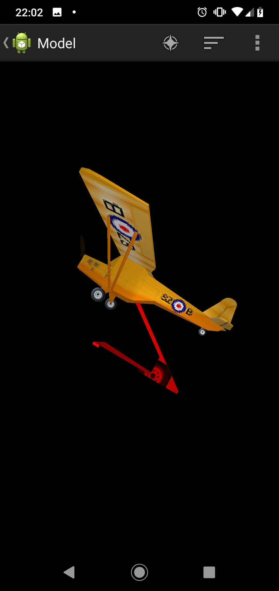
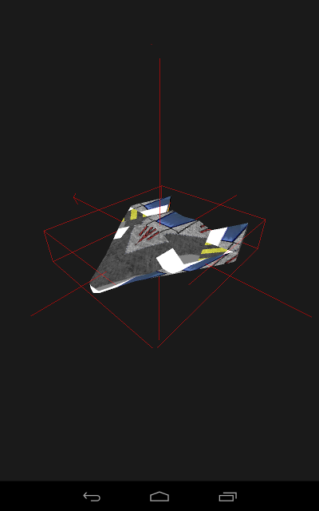
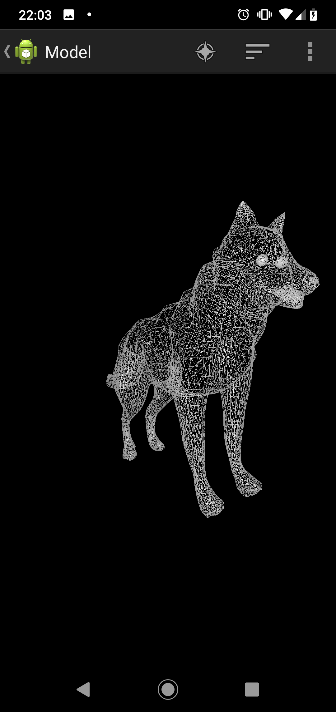
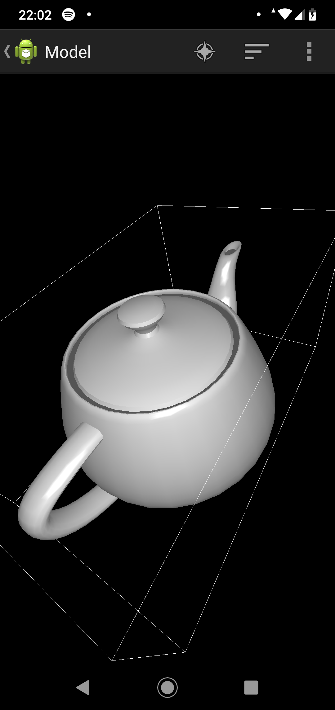
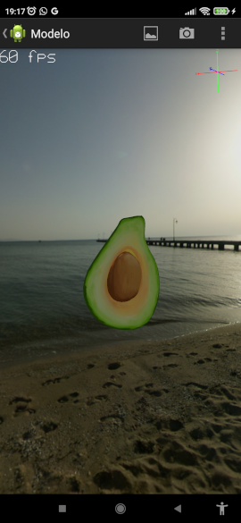
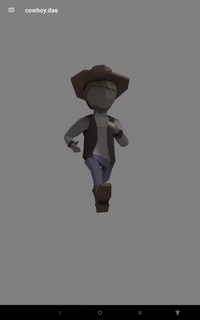
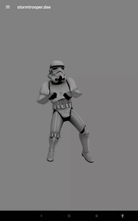

Android 3D Model Viewer
=======================

This is a demo of OpenGL ES 2.0.
It is basically an android application with a 3D engine that can load Wavefront OBJ, STL, DAE, GLTF and FBX files.
The purpose of this application is to learn and share how to draw using OpenGL language.

* GLTF format (gltf): https://www.khronos.org/gltf/
* * Collada format (DAE): https://en.wikipedia.org/wiki/COLLADA
* Wafefront format (OBJ): https://en.wikipedia.org/wiki/Wavefront_.obj_file
* STereoLithography format (STL): https://en.wikipedia.org/wiki/STL_(file_format)
* Filmbox format (FBX): https://en.wikipedia.org/wiki/Filmbox


News (10/04/2026)
=================

* User Interface completely rewritten with AI (Gemini)
* UI has now a Nav Drawer and use Fragments
* UI allows how Scene, Camera & Animation selection
* UI allows configuring Preferences for the engine
* FBX: *basic* support (no animation - no rigging)
* DAE & GLTF parsers completely rewritten with AI (Gemini)
* Bug fixes and Engine improvement
* This release is possible thanks to AI (Gemini)
* **Not yet published on Play Store!**

Demo
====

Checkout this to see the features of the application (old video): https://www.youtube.com/watch?v=PV92DKohXXk


Android Market
==============

[](https://f-droid.org/en/packages/org.andresoviedo.dddmodel2/)
[](https://play.google.com/store/apps/details?id=org.andresoviedo.dddmodel2)


Disclaimer
==========

* This is a work in progress... and the documentation as well
* Only open 3d formats or API are to be supported
* Only the most basic 3D mesh features are supported, like colors, textures and animations
* The shader is the simplest implementation supporting a very basic lighting model
* This application is tested only with a few models. Some models may not work
* In order to see models in 3D virtual reality, you need red-cyan and/or VR glasses
* Some parts of the code are being written with AI (Gemini)
* If you have any issue in general, please open an issue and attach model if possible


About
=====

Load 3D models and see how to do it with this open source code application.

The main purpose of this app is to show how to draw in android using the OpenGL 2.0/3.0 by sharing the source code.
So please, don't expect this application to be much richer or nicer than the ones already published in the app store,
but at least it's opened to anyone who wants to contribute or don't want to start a similar project from scratch.

As this is my first android app and I'm still learning the OpenGL language, it is highly probable that there are bugs;
but I will try to continue improving the app and adding more features. So please send me your comments, suggestions or
complains by opening an [issue](https://github.com/the3deer/android-3D-model-viewer/issues).

The app comes with some included 3D models that have different licenses.


Features
========

The application supports very basic features.
In order to maintain this application by adding new features, some features were disabled:

- [x] **Platform & API**
    - [x] Java 8 language
    - [x] Android >= Lollipop 5.0 (Min API Level 26 -> Target API Level 36)
    - [x] Android API: OpenGL ES 2.0/3.0, Fragments, Preferences, Content Manager
- [x] **Supported 3D Formats**
    - [x] OBJ (wavefront)
    - [x] STL (STereoLithography)
    - [x] DAE (Collada)
    - [x] GLTF (GL Transmission Format)
    - [x] FBX (Filmbox)
- [x] Core Rendering Capabilities
    - [x] Vertex, Normals, Colors, Textures, etc
    - [x] Skinning support (animation)
    - [x] Normal mapping
    - [x] Lighting
    - [x] Shadow
- [x] VR Support
    - [x] Anaglyph (red/blue)
    - [x] Stereo (left/right)
- [x] Decorators
    - [x] wireframe
    - [x] skeleton
    - [x] skybox
- [x] other:
    - [x] Polygons with holes (dae)
    - [ ] Smoothing
    - [x] Bounding box
    - [x] Ray Casting
    - [x] Repository Explorer
    - [x] Lightweight: only ? Megabyte (3d assets excluded)


Try it
======

You can install the application in either of these ways:

* Play Store:  https://play.google.com/store/apps/details?id=org.andresoviedo.dddmodel2
* APK: [app-release.apk](app/build/outputs/apk/release/app-release.apk)
* Source code: clone the repository, compile with Gradle and install with adb

Once you open the application, you can load any of the supported model formats.

* It's recommended to have all the model resources packed in a .zip file

Documentation
=============

[doc/README.md](./doc/README.md)


Compilation
===========

Script to build an apk package and run in your device.
- Git 1.6.5 or later is required
- Android Gradle plugin requires Java 17 to run

```
    git clone --recursive https://github.com/the3deer/android-3D-model-viewer.git
    cd android-3D-model-viewer
    export ANDROID_HOME=/home/$USER/Android/Sdk
    ./gradlew assembleDebug
    adb install -r app/build/outputs/apk/app-debug.apk
    adb shell am start -n org.andresoviedo.dddmodel2/org.the3deer.android.viewer.ui.MainActivity
```

Open the application. You should see a menu. From there you can load models
Once the model is rendered, pinch and rotate to see the 3D scene from another perspective.


Screenshots
===========











Emulator
========

You can run application in an emulator.  Open the provides samples to see how it works.


Tests / Validation
==================

The Android Model Viewer application has been tested in the 2 following physical devices:

    Lenovo Tab Y700   - Android 11
    Pixel 8 Pro       - Android 16


Glasses
=======

You may need one of these glasses to view models in 3D virtual reality.

[](https://amzn.to/2E8LhxC)
[](https://amzn.to/2E8M1Tq)


Dependencies
============

In order to compile the application you must either (1) clone recursively or (2) add the engine module

    # 1 liner
    git clone --recurse-submodules https://github.com/the3deer/android-3D-engine.gitz

    # 2 liner
    git clone https://github.com/the3deer/android-3D-engine.gitz
    git submodule add https://github.com/the3deer/android-3D-engine.git engine


Documentation
=============

Working on it...


Acknowledgement
===============

* For teaching how animation engine works: https://github.com/TheThinMatrix/OpenGL-Animation
* To the lot of user's feedback: https://github.com/the3deer/android-3D-model-viewer/issues
* To the many infinite educational resources found on Internet for free, thank you ! :)
* To the **AI (Gemini)**, which so far, helped me to rewrite entire parts of the engine


Credits
=======

The following copyright notice and this permission notice shall be included in all
copies or substantial portions of the Software.


    3D Viewer   - MIT License   - Copyright (c) 2022 The 3Deer - https://github.com/the3deer
    STL Parser  - GNU LGPL v2.1 - Copyright (c) 2001, 2002 Dipl. Ing. P. Szawlowski - https://code.j3d.org
    GLTF Parser - MIT License   - Copyright (c) 2016 Marco Hutter - https://github.com/javagl/JglTF
    FBX Parser  - MIT License   - Copyright (c) 2020 Samuli Raivio - https://github.com/ufbx/ufbx
    EarCut      - ISC License   - Copyright (c) 2016, Mapbox - https://github.com/the3deer/earcut


Demo Assets

* cowboy       : Unlicense License - https://github.com/TheThinMatrix/OpenGL-Animation
* fox          : CC0: Low poly fox by PixelMannen, CC-BY 4.0: Rigging and animation by @tomkranis on Sketchfab
* stormtrooper : MIT License - https://github.com/hujiulong/vue-3d-model
* toyplane     : Editorial Uses Only - https://blog.turbosquid.com/turbosquid-3d-model-license/#Editorial-Usage
* skybox sea   : https://learnopengl.com/Advanced-OpenGL/Cubemaps
* skybox sand  : Copyright 2012 Mobialia - https://github.com/mobialia/jmini3d
* models (parts)  : Community contribution (Professor S)
 
